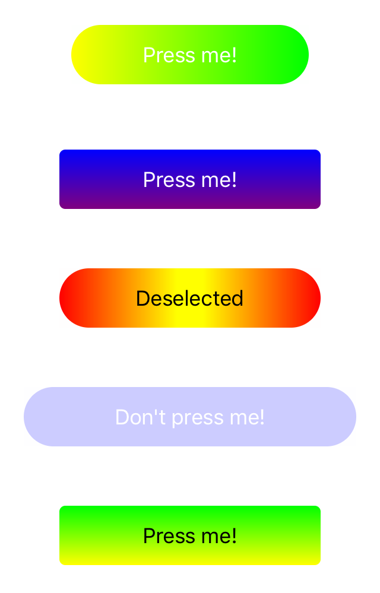

# SimpleGradientButton

Simple gradient button for iOS written in Swift. You can specify colors for vertical or horizontal gradient without touching Core Animation. Also, it supports rounded corners for your convenience.



## Requirements

* iOS 8.0+
* Xcode 10.0+
* Swift 4.2

## Installation

### CocoaPods

SimpleGradientButton is available through [CocoaPods](https://cocoapods.org). To install
it, simply add the following line to your Podfile:

```ruby
pod 'SimpleGradientButton'
```

Then, run following command:

```
pod install
```

### Carthage

[Carthage](https://github.com/Carthage/Carthage) is supported too. Add this line to your Cartfile:

```
github "ildar-gilfanov/SimpleGradientButton" ~> 1.0
```

Then, run following command:

```
carthage update
```

## Example

Don't forget to import module:

``` swift
import SimpleGradientButton
```

### Simplest example

You create button as normal and pass array of GradientColor to specify colors. Second parameter of constructor is relative position of gradient point.

``` swift
let button = GradientButton()
button.setTitle("Press me!", for: .normal)
if let color1 = GradientColor(color: .yellow, position: 0),
    let color2 = GradientColor(color: .green, position: 1.0) {
    
    button.setGradientColors([color1, color2], for: .normal)
}
```

### Customisation

You can specify gradient direction, corner radius and enable animation for color changing.

``` swift
let button = GradientButton()
button.setTitle("Press me!", for: .normal)
button.gradientDirection = .horizontal // horizontal or vertical
button.cornerRadius = .specific(4.0) // specific or automatic (height / 2)
button.disableGradientChangeAnimation = false // enable implicit CoreAnimation's animation

// You don't have to sort colors by position
if let color1 = GradientColor(color: .red, position: 0),
    let color2 = GradientColor(color: .yellow, position: 1.0),
    let color3 = GradientColor(color: .orange, position: 0.5) {
    
    button.setGradientColors([color1, color2, color3], for: .normal)
}
```

### Gradient color is state specific

You can choose different gradients for each state of button.

``` swift
let button = GradientButton()
button.setTitle("Press me!", for: .normal)

// Gradient from one color is also posible. Position in this case is ignored.
if let color = GradientColor(color: .cyan, position: 0) {
    button.setGradientColors([color], for: .normal)
}
if let color1 = GradientColor(color: .green, position: 0),
    let color2 = GradientColor(color: .blue, position: 1.0) {
    
    button.setGradientColors([color1, color2], for: .highlighted)
}
```

## License

SimpleGradientButton is available under the MIT license. See the LICENSE file for more info.
